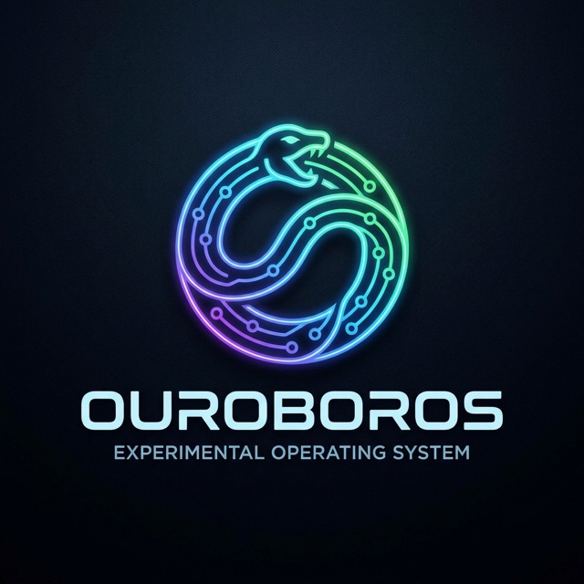

<p align="center">
  
</p>

# Ouroboros

A microkernel operating system for ARM64 (aarch64), written in Rust with some assembly.

**[Project site & debugging postmortems →](https://hansolovkarlsson.github.io/Ouroboros/)**

**[User manual →](docs/manual.md)** — building, running (QEMU &
Parallels), testing, shell usage, and the syscall ABI, in one place.

## Design goals

- Microkernel architecture, POSIX-ish system calls
- Preemptive multitasking
- ARM64 target, developed and tested primarily in Parallels on Apple Silicon
- Filesystem support TBD — likely a simple filesystem to start
- Draws inspiration from Linux, Minix, and Plan 9

## Boot strategy

The kernel boots as a UEFI application (`kernel/`, built for the
`aarch64-unknown-uefi` target), rather than being loaded directly by an
emulator's `-kernel` flag. This is because Parallels boots ARM VMs through
UEFI firmware and has no equivalent of QEMU's direct-kernel-boot shortcut, so
UEFI is the one boot path that works on both the fast QEMU dev loop and the
real Parallels test target.

Right now the kernel *is* the UEFI application — there's no separate
bootloader stage yet. As the kernel grows past what's reasonable to run under
UEFI boot services, expect this to split into a thin UEFI bootloader that
loads and hands off to a separate kernel binary.

## Prerequisites

- Rust, via `rustup` (the pinned toolchain and `aarch64-unknown-uefi` target
  install automatically from `rust-toolchain.toml` on first `cargo build`)
- [QEMU](https://www.qemu.org/) for the local dev loop: `brew install qemu`
  (this also provides the aarch64 OVMF firmware used by `make run`)
- Parallels Desktop for testing against the real target environment

## Building

```sh
make build        # cargo build, debug profile
make build PROFILE=release
```

## Running in QEMU

```sh
make run
```

This stages `target/aarch64-unknown-uefi/debug/BOOTAA64.efi` into `esp/EFI/BOOT/BOOTAA64.EFI`
(the well-known path UEFI firmware boots automatically from removable media)
and boots it in `qemu-system-aarch64 -machine virt` against Homebrew's
aarch64 OVMF firmware.

## Testing in Parallels

```sh
make parallels-hdd
```

Produces `esp.hdd`, a Parallels-native virtual hard disk with the kernel at
`EFI/BOOT/BOOTAA64.EFI`. Create a new Parallels VM of type "Other" with no
installed OS, and in its Hardware settings attach `esp.hdd` as the **Hard
Disk** device specifically:

- Not `esp.img` directly — Parallels' Hard Disk device only accepts its own
  `.hdd` format, not a raw disk image.
- Not the CD/DVD device — that expects an ISO9660 optical filesystem, and
  `esp.img`/`esp.hdd` is an MBR+FAT32 hard disk image. Attaching it there
  makes firmware see a block device but find no filesystem on it.

`esp.hdd` is a thin wrapper that points at `esp.dmg`'s absolute path rather
than embedding its data — keep both files together; `make clean` removes
them as a pair.

`make parallels-hdd` requires Parallels Desktop to be installed (it shells
out to `prl_disk_tool`, bundled with the app).

Start the VM once attached — UEFI firmware should pick up `BOOTAA64.EFI`
from the disk automatically, the same way it does in QEMU.

## Layout

```
kernel/     the kernel, built as a UEFI application (aarch64-unknown-uefi)
```
